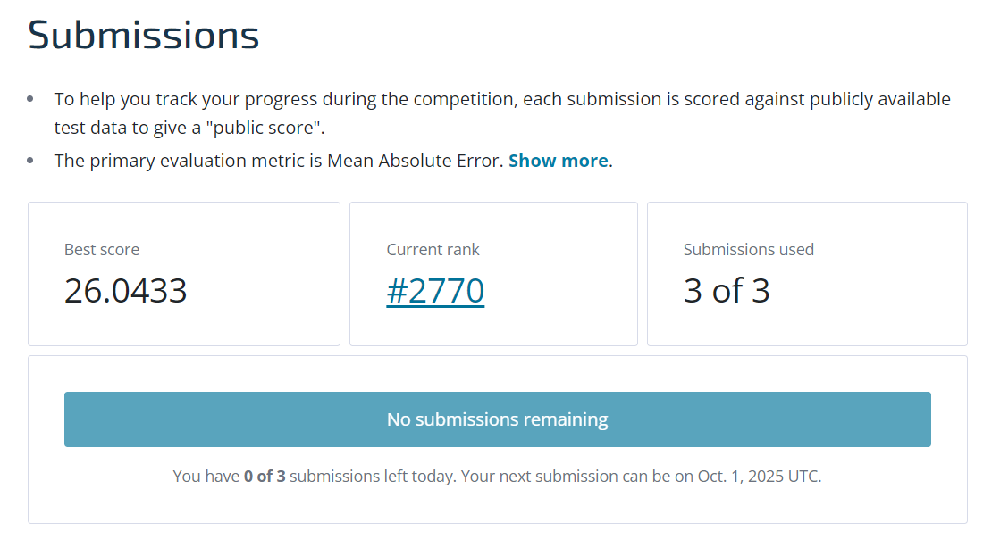
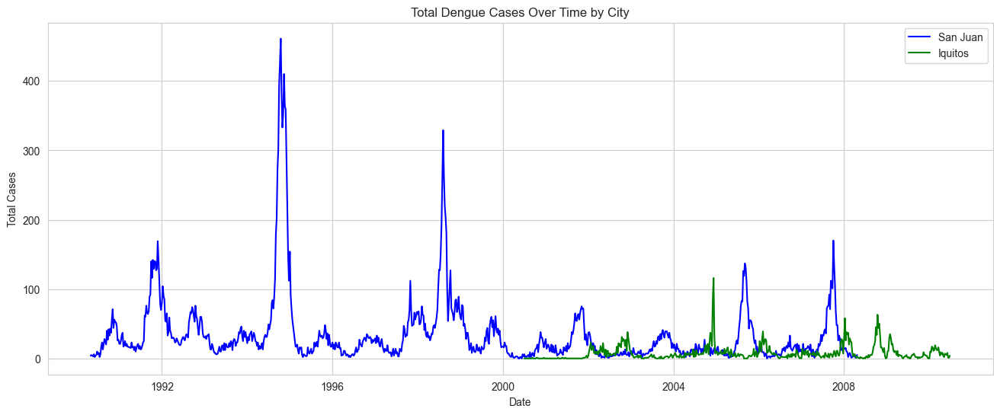
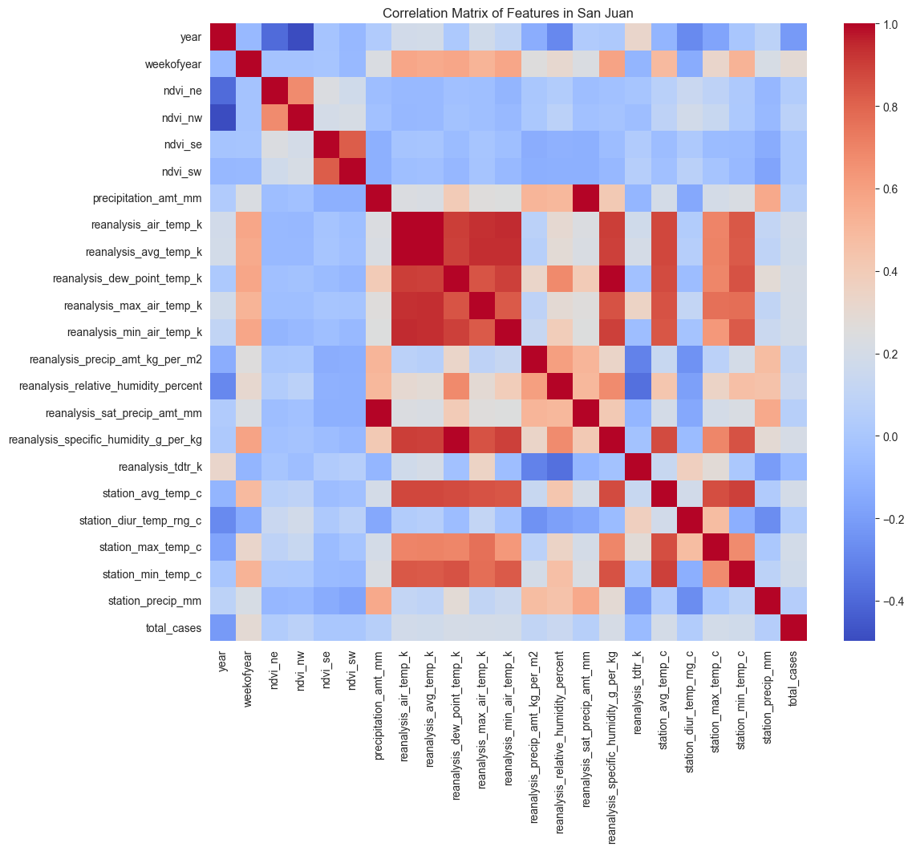
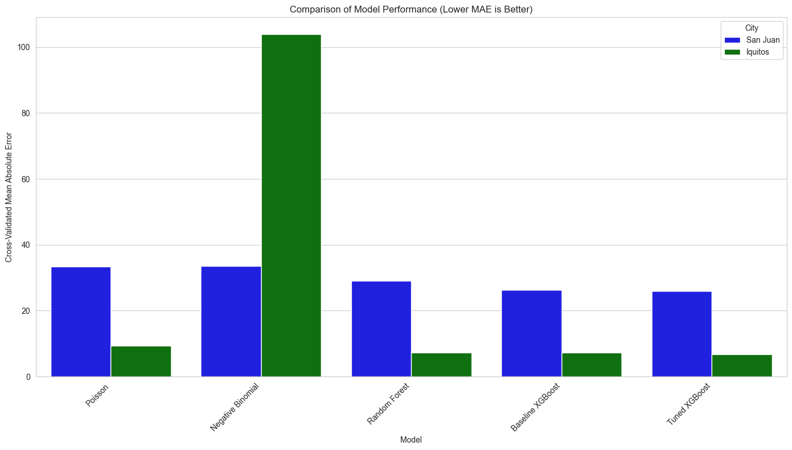

# DengAI: Predicting Disease Spread 🦟📊

A comprehensive machine learning project for predicting dengue fever outbreaks using environmental and climate data from San Juan, Puerto Rico and Iquitos, Peru. This project achieved **rank 2770 out of 6790** participants in the DengAI competition.



## 📋 Table of Contents

- [Project Overview](#project-overview)
- [Competition Results](#competition-results)
- [Problem Statement](#problem-statement)
- [Dataset Description](#dataset-description)
- [Project Structure](#project-structure)
- [Installation & Setup](#installation--setup)
- [Usage](#usage)
- [Step-by-Step Notebook Walkthrough](#step-by-step-notebook-walkthrough)
- [Methodology](#methodology)
- [Results](#results)
- [Key Findings](#key-findings)
- [Future Improvements](#future-improvements)
- [Technical Implementation](#technical-implementation)
- [Contributors](#contributors)

## 🎯 Project Overview

This project aims to predict the number of dengue fever cases in two cities using machine learning techniques. Dengue fever is a mosquito-borne illness that poses significant public health challenges in tropical and subtropical regions. By accurately forecasting dengue outbreaks, public health officials can implement timely control measures and allocate resources effectively.

The complete analysis and modeling approach is documented in **`Final_Notebook2.ipynb`**, which contains a comprehensive workflow including data exploration, feature engineering, model development, and evaluation.

## 🏆 Competition Results

This project was submitted to the DengAI competition and achieved:
- **Rank: 2770 out of 6790 participants**
- **Percentile: Top 41%**

The ranking demonstrates solid performance in a competitive machine learning challenge with thousands of participants worldwide.

## 🔍 Problem Statement

Dengue fever transmission is heavily influenced by environmental factors such as:
- **Temperature** - affects mosquito life cycle
- **Precipitation** - creates breeding sites
- **Humidity** - influences mosquito survival
- **Vegetation indices** - indicate environmental conditions

**Goal**: Build a machine learning model that can predict weekly dengue case counts based on environmental and climate data, enabling proactive public health responses.

## 📊 Dataset Description

The project uses three main datasets:

### Training Data
- **`dengue_features_train.csv`** - Environmental and climate features (1,458 rows)
- **`dengue_labels_train.csv`** - Corresponding dengue case counts (1,458 rows)

### Test Data  
- **`dengue_features_test.csv`** - Features for prediction (416 rows)

### Key Features:
- **Location**: San Juan (sj) and Iquitos (iq)
- **Time**: Year, week of year, week start date
- **NDVI**: Normalized Difference Vegetation Index (4 quadrants)
- **Climate**: Temperature, precipitation, humidity measurements
- **Weather Station Data**: Local temperature and precipitation readings

## 📁 Project Structure

```
ML_py-Group-Project/
├── README.md                      # Project documentation
├── Final_Notebook2.ipynb          # Main Jupyter notebook with comprehensive analysis
├── final_submission.csv           # Final competition submission (XGBoost)
├── our_submission.csv             # Previous submission
├── requirements.txt               # Python dependencies
├── Analysis_Images/               # All visualization outputs
│   ├── Data_Visu1.png             # Time series data visualization
│   ├── heatmap_corr_sj.png        # San Juan correlation heatmap
│   ├── Models_Comparision.png     # Model performance comparison visualization
│   └── Rank.png                   # Competition ranking screenshot
└── Data/
    ├── dengue_features_train.csv      # Training features (1,458 rows)
    ├── dengue_labels_train.csv        # Training labels (1,458 rows)
    └── dengue_features_test.csv       # Test features (416 rows)
```

## 🚀 Installation & Setup

### Prerequisites
- Python 3.7+
- Jupyter Notebook

### Step 1: Clone the Repository
```bash
git clone <repository-url>
cd ML_py-Group-Project
```

### Step 2: Install Dependencies
```bash
pip install -r requirements.txt
```

### Step 3: Launch Jupyter Notebook
```bash
jupyter notebook Final_Notebook2.ipynb
```

## 💻 Usage

1. **Open the Jupyter Notebook**: Launch `Final_Notebook2.ipynb`
2. **Run All Cells**: Execute the notebook from top to bottom
3. **View Results**: Analyze the model performance and predictions

## 📚 Step-by-Step Notebook Walkthrough

The notebook follows a comprehensive data science workflow with clear progression through each phase:

### Step 1: Problem Definition & Motivation
**What it does:** Establishes the public health challenge and explains why ML can help predict dengue outbreaks.
**Key insight:** Early warning systems can enable proactive public health interventions, reducing disease burden.

### Step 2: Data Loading & Initial Setup
**What it does:** Loads training and test datasets with robust error handling.
**Key insight:** Data integrity check reveals missing values in climate variables that need careful handling.

### Step 3: Exploratory Data Analysis (EDA)
**What it does:** Creates comprehensive visualizations to understand data patterns.


*Time series analysis showing different outbreak patterns between San Juan (blue) and Iquitos (green)*


*Feature correlation matrix for San Juan - reveals relationships between climate variables*

**Key findings:**
- San Juan: Cyclical, seasonal outbreaks with major spikes every few years
- Iquitos: More sporadic, unpredictable outbreak patterns
- Strong seasonal components in both cities but different peak periods

### Step 4: Feature Engineering & Data Preparation
**What it does:** Creates 41 advanced features including temporal lags and rolling averages.
**Key transformations:**
- **Lag features:** 4, 8, 12-week delays for key climate variables
- **Rolling averages:** 3, 6, 12-week trend capture
- **Interaction terms:** Temperature × humidity combinations
- **Temporal encoding:** Month and week-of-year features

### Step 5: Model Building & Robust Evaluation
**What it does:** Implements 5 different models with time-series cross-validation.


*Cross-validation performance comparison across all models*

**Models tested:**
1. **Poisson Regression** - Baseline for count data
2. **Negative Binomial** - Handles overdispersion
3. **Random Forest** - Non-linear ensemble
4. **XGBoost (Baseline)** - Gradient boosting
5. **Tuned XGBoost** - Hyperparameter optimized

### Step 6: Model Comparison & Selection
**What it does:** Statistical comparison reveals XGBoost as the clear winner.
**Decision criteria:** MAE and RMSE across time-series cross-validation folds.

### Step 7: Final Model Training & Submission
**What it does:** Trains optimized models on full dataset and generates predictions.
**Output:** `final_submission.csv` with weekly dengue case forecasts.

### Step 8: Conclusion & Impact Analysis
**What it does:** Evaluates model's real-world applicability and potential public health impact.
**Key conclusion:** Model provides actionable early warning system for resource allocation and targeted interventions.

## 🔬 Methodology

### Data Preprocessing
- **Missing Value Handling**: Forward-fill and backfill techniques for temporal consistency
- **Feature Engineering**: Comprehensive feature creation including:
  - **Lag Features**: 4, 8, and 12-week lags for key climate variables (precipitation, temperature, humidity)
  - **Rolling Averages**: 3, 6, and 12-week rolling means to capture trends
  - **Interaction Terms**: Temperature-humidity interactions
  - **Temporal Features**: Month and week-of-year encoding
  - **Total Features**: 41 engineered features per city

### Model Selection & Evaluation
- **Algorithms**: Comprehensive comparison of 5 different models:
  - **PoissonRegressor**: Generalized linear model baseline for count data
  - **NegativeBinomialRegressor**: Extension of Poisson to handle overdispersion with hyperparameter tuning
  - **RandomForestRegressor**: Non-linear ensemble model with hyperparameter optimization
  - **XGBoost (Baseline)**: Gradient boosting with Poisson objective function
  - **Tuned XGBoost**: Hyperparameter-optimized version via GridSearchCV (learning rate, max depth, n_estimators, colsample_bytree)
- **Rationale**: Multiple model comparison to find the best performer for dengue case prediction
- **Approach**: Separate models for each city due to vastly different outbreak patterns

### Cross-Validation Strategy
- **TimeSeriesSplit**: 5-fold time-series aware cross-validation to prevent data leakage
- **Motivation**: Standard k-fold CV is inappropriate for time-series data as it allows training on future data
- **Evaluation Metrics**:
  - **Mean Absolute Error (MAE)**: Primary evaluation metric
  - **Root Mean Squared Error (RMSE)**: Secondary metric for outlier sensitivity

## 📈 Results

The project successfully builds predictive models for both cities and achieved competitive performance through comprehensive model comparison:

### Model Performance Comparison (Cross-Validation Results)

| Model | City | CV MAE | CV RMSE | Best Parameters |
|-------|------|---------|---------|----------------|
| **Tuned XGBoost** | San Juan | **25.92** | **44.23** | lr=0.1, depth=5, n_est=250, colsample=1.0 |
| **Tuned XGBoost** | Iquitos | **6.78** | **11.52** | lr=0.05, depth=3, n_est=100, colsample=0.7 |
| Baseline XGBoost | San Juan | 26.31 | 44.63 | Default parameters |
| Baseline XGBoost | Iquitos | 7.30 | 12.07 | Default parameters |
| Random Forest | San Juan | 29.12 | 45.01 | depth=5, min_leaf=5, n_est=100 |
| Random Forest | Iquitos | 7.27 | 11.62 | depth=5, min_leaf=10, n_est=100 |
| Poisson | San Juan | 33.41 | 53.48 | alpha=0.1 |
| Poisson | Iquitos | 9.38 | 14.99 | alpha=0.1 |
| Negative Binomial | San Juan | 33.49 | 53.31 | alpha=0.5 |
| Negative Binomial | Iquitos | 103.85 | 432.91 | alpha=0.01 |

### Key Performance Insights

1. **XGBoost Dominance**: Tuned XGBoost achieved the best performance for both cities, with hyperparameter tuning providing meaningful improvements over the baseline
2. **City-Specific Optimization**: Different optimal hyperparameters for each city reflect their distinct outbreak patterns
3. **Non-linear Relationships**: Tree-based models (Random Forest, XGBoost) significantly outperformed linear models, indicating complex non-linear relationships
4. **Overdispersion Handling**: Negative Binomial performed poorly on Iquitos data, suggesting the overdispersion assumption may not hold for this dataset

### Competition Results
- **Competition Ranking**: 2770 out of 6790 participants (Top 41%)
- **Final Model**: Tuned XGBoost with city-specific hyperparameters
- **Submission File**: `final_submission.csv` (generated using best-performing models)

### Visual Results Summary

The analysis reveals clear patterns and model performance through comprehensive visualizations:

**Data Patterns:**

*Time series showing distinct outbreak patterns - San Juan exhibits cyclical seasonality while Iquitos shows sporadic, unpredictable spikes*

**Feature Relationships:**

*Climate variable correlations reveal strong relationships between temperature, humidity, and precipitation measurements*

**Model Performance:**

*Cross-validation results demonstrate XGBoost's superior performance across both cities, with significant improvements over baseline models*

## 🔑 Key Findings

1. **City-Specific Patterns**: San Juan and Iquitos exhibit vastly different dengue outbreak patterns, justifying separate models with different optimal hyperparameters
2. **Model Performance Hierarchy**: 
   - **Best**: Tuned XGBoost (MAE: 25.92 for SJ, 6.78 for IQ)
   - **Second**: Random Forest (MAE: 29.12 for SJ, 7.27 for IQ)
   - **Baseline**: Linear models (Poisson/Negative Binomial) performed significantly worse
3. **Non-linear Relationships**: Tree-based models dramatically outperformed linear models, indicating complex environmental-disease relationships
4. **Feature Engineering Impact**: 
   - Lag features (4, 8, 12-week delays) capture delayed environmental effects
   - Rolling averages capture trend patterns
   - Interaction terms (temperature × humidity) improve predictive power
5. **Hyperparameter Sensitivity**: City-specific tuning was crucial - different optimal parameters for each location
6. **Overdispersion**: Negative Binomial model assumptions didn't hold for Iquitos data, performing worse than simple Poisson

## 🚀 Future Improvements

Based on the comprehensive analysis, potential areas for enhancement include:

- **Deep Learning Models**: Experiment with LSTM/GRU networks to capture long-term temporal dependencies
- **Advanced Feature Engineering**: 
  - Fourier transforms for seasonal pattern detection
  - Weather station-specific features for San Juan
  - Cross-correlation features between cities
- **Ensemble Methods**: Combine XGBoost with Random Forest or other models for improved robustness
- **Real-time Integration**: Deploy model for real-time outbreak prediction with weekly updates
- **External Data Sources**: Incorporate additional environmental data (mosquito surveillance, population density)
- **Uncertainty Quantification**: Add prediction intervals to assess forecast reliability

## 🛠️ Technical Implementation

### Model Architecture
- **Final Model**: Tuned XGBoost Regressor with Poisson objective function
- **Hyperparameter Optimization**: GridSearchCV with 5-fold TimeSeriesSplit
- **Feature Engineering Pipeline**: Automated feature creation with lag and rolling window functions
- **Cross-Validation**: Time-series aware validation preventing data leakage

### Performance Optimization
- **City-Specific Models**: Separate optimized models for San Juan and Iquitos
- **Feature Selection**: 41 engineered features including temporal lags and interactions
- **Model Tuning**: Comprehensive hyperparameter search for optimal performance
- **Production Ready**: Automated prediction pipeline with post-processing

### Code Quality
- **Reproducible Results**: Fixed random seeds and deterministic algorithms
- **Error Handling**: Robust data loading with comprehensive error messages
- **Documentation**: Detailed explanations for each modeling decision
- **Modular Design**: Reusable functions for feature engineering and evaluation

## 👥 Contributors

This project was developed as a group AI7101 Machine Learning with Python project. 

---

## 📝 License

This project is available for educational and research purposes.

