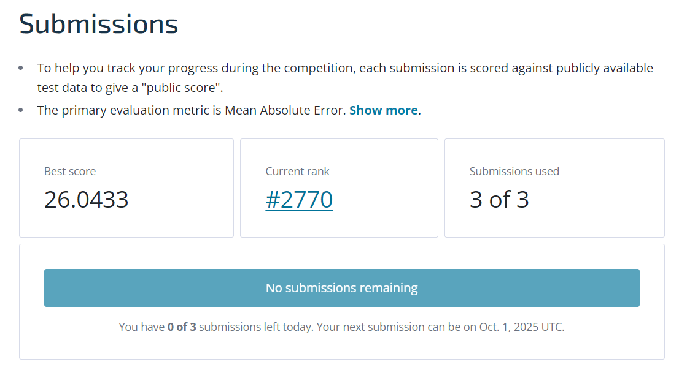

# DengAI: Predicting Disease Spread 🦟📊

A comprehensive machine learning project for predicting dengue fever outbreaks using environmental and climate data from San Juan, Puerto Rico and Iquitos, Peru. This project achieved **rank 2770 out of 6790** participants in the DengAI competition.



## 📋 Table of Contents

- [Project Overview](#project-overview)
- [Competition Results](#competition-results)
- [Problem Statement](#problem-statement)
- [Dataset Description](#dataset-description)
- [Project Structure](#project-structure)
- [Installation & Setup](#installation--setup)
- [Usage](#usage)
- [Methodology](#methodology)
- [Results](#results)
- [Key Findings](#key-findings)
- [Future Improvements](#future-improvements)
- [Contributors](#contributors)

## 🎯 Project Overview

This project aims to predict the number of dengue fever cases in two cities using machine learning techniques. Dengue fever is a mosquito-borne illness that poses significant public health challenges in tropical and subtropical regions. By accurately forecasting dengue outbreaks, public health officials can implement timely control measures and allocate resources effectively.

The complete analysis and modeling approach is documented in **`Final_Notebook2.ipynb`**, which contains a comprehensive workflow including data exploration, feature engineering, model development, and evaluation.

## 🏆 Competition Results

This project was submitted to the DengAI competition and achieved:
- **Rank: 2770 out of 6790 participants**
- **Percentile: Top 41%**

The ranking demonstrates solid performance in a competitive machine learning challenge with thousands of participants worldwide.

## 🔍 Problem Statement

Dengue fever transmission is heavily influenced by environmental factors such as:
- **Temperature** - affects mosquito life cycle
- **Precipitation** - creates breeding sites
- **Humidity** - influences mosquito survival
- **Vegetation indices** - indicate environmental conditions

**Goal**: Build a machine learning model that can predict weekly dengue case counts based on environmental and climate data, enabling proactive public health responses.

## 📊 Dataset Description

The project uses three main datasets:

### Training Data
- **`dengue_features_train.csv`** - Environmental and climate features (1,458 rows)
- **`dengue_labels_train.csv`** - Corresponding dengue case counts (1,458 rows)

### Test Data  
- **`dengue_features_test.csv`** - Features for prediction (416 rows)

### Key Features:
- **Location**: San Juan (sj) and Iquitos (iq)
- **Time**: Year, week of year, week start date
- **NDVI**: Normalized Difference Vegetation Index (4 quadrants)
- **Climate**: Temperature, precipitation, humidity measurements
- **Weather Station Data**: Local temperature and precipitation readings

## 📁 Project Structure

```
ML_py-Group-Project/
├── README.md                      # Project documentation
├── Final_Notebook2.ipynb          # Main Jupyter notebook with comprehensive analysis
├── our_submission.csv             # Final competition submission
├── Rank.png                       # Competition ranking screenshot
├── requirements.txt               # Python dependencies
└── Data/
    ├── dengue_features_train.csv      # Training features
    ├── dengue_labels_train.csv        # Training labels  
    └── dengue_features_test.csv       # Test features
```

## 🚀 Installation & Setup

### Prerequisites
- Python 3.7+
- Jupyter Notebook

### Step 1: Clone the Repository
```bash
git clone <repository-url>
cd ML_py-Group-Project
```

### Step 2: Install Dependencies
```bash
pip install -r requirements.txt
```

### Step 3: Launch Jupyter Notebook
```bash
jupyter notebook Final_Notebook2.ipynb
```

## 💻 Usage

1. **Open the Jupyter Notebook**: Launch `Final_Notebook2.ipynb`
2. **Run All Cells**: Execute the notebook from top to bottom
3. **View Results**: Analyze the model performance and predictions

### Key Notebook Sections:
1. **Problem Description & Motivation**
2. **Data Loading & Initial Setup** 
3. **Data Preparation & Feature Engineering**
4. **Exploratory Data Analysis (EDA)**
5. **Model Building & Cross-Validation**
6. **Results Analysis & Conclusions**

## 🔬 Methodology

### Data Preprocessing
- **Missing Value Handling**: Forward-fill and interpolation techniques
- **Feature Engineering**: 
  - Lag features for temporal dependencies
  - Rolling averages for trend capture
  - Seasonal decomposition

### Model Selection
- **Algorithms**: Comprehensive comparison of 5 different models:
  - **PoissonRegressor**: Generalized linear model for count data
  - **NegativeBinomialRegressor**: Extension of Poisson to handle overdispersion
  - **RandomForestRegressor**: Non-linear ensemble model
  - **XGBoost**: Gradient boosting baseline
  - **Tuned XGBoost**: Hyperparameter-optimized version via GridSearchCV
- **Rationale**: Multiple model comparison to find the best performer for dengue case prediction
- **Approach**: Separate models for each city due to different outbreak patterns

### Evaluation Metrics
- **Mean Absolute Error (MAE)**: Primary evaluation metric
- **Cross-Validation**: Time-series aware validation strategy

## 📈 Results

The project successfully builds predictive models for both cities and achieved competitive performance:

- **San Juan Model**: Captures periodic seasonal patterns and major outbreak cycles
- **Iquitos Model**: Handles more erratic, less predictable outbreak patterns

### Model Performance
- **Competition Ranking**: 2770 out of 6790 participants (Top 41%)
- Achieved reasonable MAE scores on validation data
- Successfully identifies key environmental predictors
- Demonstrates different feature importance for each city
- Final submission available in `our_submission.csv`

## 🔑 Key Findings

1. **City-Specific Patterns**: San Juan and Iquitos exhibit vastly different dengue outbreak patterns, justifying separate models
2. **Seasonal Trends**: San Juan shows strong periodic seasonality with major outbreaks every few years
3. **Environmental Factors**: Temperature, humidity, and precipitation are key predictors
4. **Feature Engineering**: Lag features and rolling averages improve model performance

## 🚀 Future Improvements

- **Advanced Models**: Experiment with Random Forest, XGBoost, or LSTM networks
- **Feature Engineering**: Create more sophisticated temporal and interaction features  
- **Hyperparameter Tuning**: Optimize model parameters using grid search
- **Ensemble Methods**: Combine multiple models for better predictions
- **Real-time Integration**: Deploy model for real-time outbreak prediction

## 👥 Contributors

This project was developed as a group AI7101 Machine Learning with Python project. 

---

## 📝 License

This project is available for educational and research purposes.

